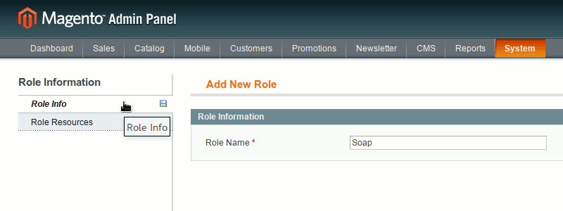
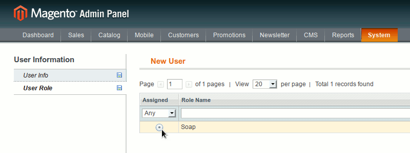

# MagentoConnectorBundle for Akeneo

Welcome on the Akeneo PIM Magento connector bundle.

This repository is issued to develop the Magento Connector for Akeneo PIM.

Warning: this connector is not production ready and is intended for evaluation and development purposes only!

# Requirements

 - php5-xml
 - php5-soap
 - Akeneo PIM CE 1.2.x stable
 - Magento from CE 1.6 to 1.9 and EE 1.11 to 1.14
 - MongoDB (optional)

If you want to manage configurable products, you **must add [magento-improve-api](https://github.com/jreinke/magento-improve-api)** in your Magento installation.

# Installation instructions

Please make sure that your version of PHP has support for SOAP and XML (natively coming with PHP for Debian based distributions).

## Installing the Magento Connector in an Akeneo PIM standard installation

If not already done, install Akeneo PIM (see [this documentation](https://github.com/akeneo/pim-community-standard)).

The PIM installation directory where you will find `app`, `web`, `src`, ... is called thereafter `/my/pim/installation/dir`.

Get composer:

    $ cd /my/pim/installation/dir
    $ curl -sS https://getcomposer.org/installer | php

Install the MagentoConnector with composer:

    $ php composer.phar require akeneo/magento-connector-bundle:1.2.*

Enable the bundle in the `app/AppKernel.php` file, in the `registerBundles` function just before the `return $bundles` line:

    $bundles[] = new Pim\Bundle\MagentoConnectorBundle\PimMagentoConnectorBundle();

You can now update your database:

    php app/console doctrine:schema:update --force

Don't forget to reinstall pim assets:

    php app/console pim:installer:assets

## Installing the Magento Connector in an Akeneo PIM development environment (master)

The following installation instructions are meant for development on the Magento connector itself, and should not be used in production environments. Start by setting up a working installation as previously explained, but use de dev-master version:

    $ php composer.phar require akeneo/magento-connector-bundle:dev-master

Then clone the git repository of the Magento connector bundle anywhere on your file system, and create a symbolic link to the vendor folder of your Akeneo installation's (after renaming/deleting the original one).

You can now update your database and reinstall pim assets as explained previously.

# Magento side configuration

In order to export products to Magento, a SOAP user with full rights has to be created on Magento.

For that, in the Magento Admin Panel, access `Web Services > SOAP/XML-RPC - Roles`, then click on `Add New Role` button. Create a role, choose a name, for instance “Soap”, and select `All` in Roles Resources.

*Role name setup example*:

*Role resources setup example*:

Now you can create a soap user. Go to `Web Services > SOAP/XML-RPC - Users` and click on “Add New User” button. Complete user info at your liking, then select “Soap” role (or whatever name you gave to it) in the User Role section.

*User setup example*:

*User role setup example*:

After that you can go to `Spread > Export profiles` on Akeneo PIM and create your first Magento export job. For more informations, go take a look to the [user guide](./Resources/doc/userguide.md).

# Demo fixtures

To test the connector with the minimum data requirements, you can load the demo fixtures. Change the `installer_data` line from the `app/config/parameters.yml` file to:

    installer_data: PimMagentoConnectorBundle:demo_magento

Two locales are activated by default, so for the export jobs to work out of the box, you need to add to your Magento environment a storeview with the code `fr_fr`.

# Bug and issues

This bundle is still under active development. Expect bugs and instabilities. Feel free to report them on this repository's [issue section](https://github.com/akeneo/MagentoConnectorBundle/issues).

# Troubleshooting

You can find solutions for some common problems in the [troubleshooting section](./Resources/doc/troubleshooting.md).
